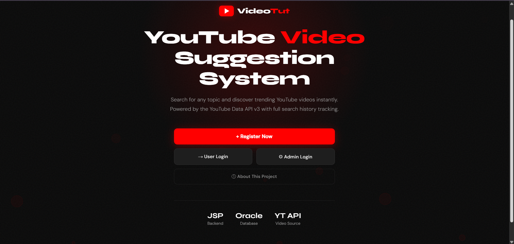
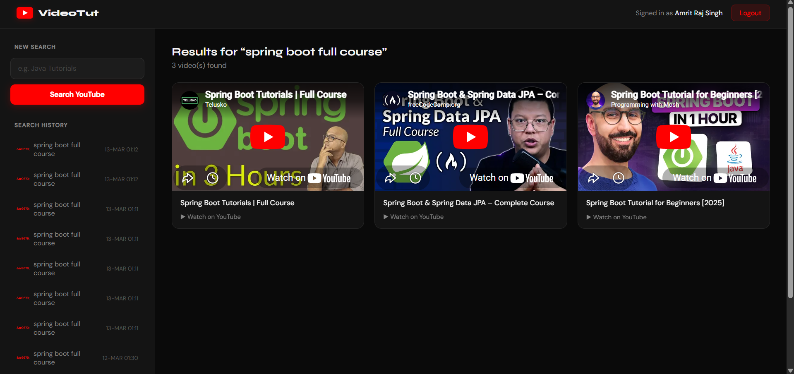
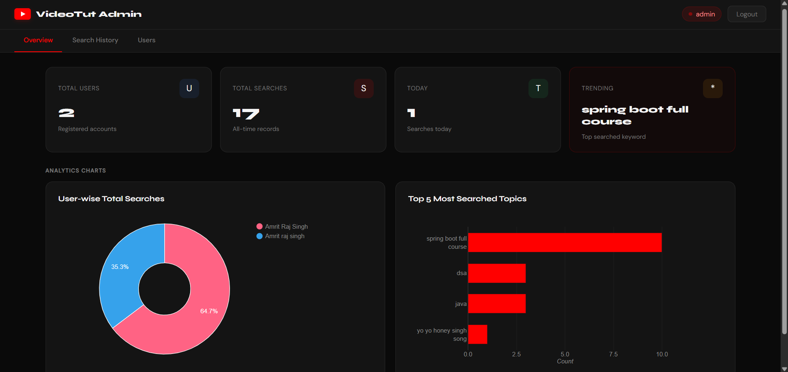
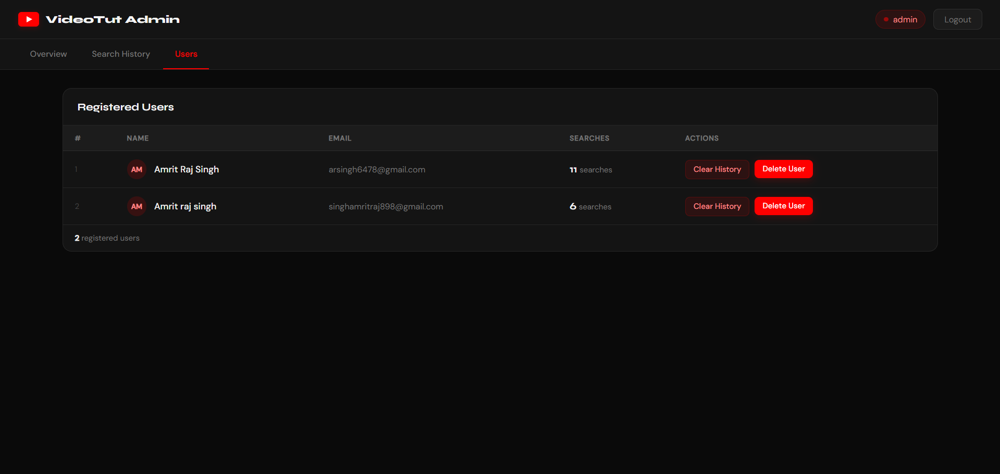

<div align="center">

<h1>🎬 VideoTut</h1>
<h3>YouTube Video Suggestion System</h3>

<p>
  
  
  
  
  
  
  
</p>

<p>A web-based YouTube video suggestion system where users search for any topic<br/>and get live YouTube results — with full search history tracking and an admin analytics panel.</p>

<br/>

> 🏫 **B.Tech Project** · Computer Science & Information Technology · Trident Academy of Technology, Bhubaneswar · JSP &amp; Oracle Database Project

</div>

---

## 📑 Table of Contents

- [About](#-about)
- [Features](#-features)
- [Screenshots](#-screenshots)
- [Project Structure](#-project-structure)
- [Database Setup](#-database-setup)
- [Prerequisites](#-prerequisites)
- [Getting Started](#-getting-started)
- [How the Search System Works](#-how-the-search-system-works)
- [How User Registration Works](#-how-user-registration-works)
- [Access Control](#-access-control)
- [Libraries Used](#-libraries-used)
- [Changing DB Credentials](#-changing-db-credentials)
- [Troubleshooting](#-troubleshooting)
- [Author](#-author)

---

## 🧠 About

**VideoTut** is a B.Tech semester project built with JSP and Oracle Database. The goal was to build a full-stack Java web application that connects to a real external API and stores user activity in a relational database.

The system provides:
- 👤 **Users** register and log in to search for YouTube videos on any topic
- 🎬 **YouTube Data API v3** fetches live video results based on the search keyword
- 📜 **Search history** is automatically saved to Oracle DB for every user
- 👨‍💼 **Admin** gets a dedicated dashboard with charts, analytics, and full control over users and history

---

## ✨ Features

- 🔐 **Role-based login** — separate dashboards for Admin and regular Users
- 📝 **User registration** — stores name, email, and password
- 🔍 **YouTube video search** — live results fetched from YouTube Data API v3
- 📺 **Embedded video player** — watch videos directly inside the dashboard
- 📜 **Search history** — every search is saved to Oracle DB with timestamp
- 🕘 **History sidebar** — users can re-run any past search with one click
- 📊 **Admin dashboard** — live stats cards, pie chart, and bar chart via Google Charts
- 🗂️ **Tabbed admin panel** — Overview, Search History, and Users in separate tabs
- 🔎 **Filter & search logs** — admin can filter history by user name or keyword
- 🗑️ **Delete controls** — delete single records, clear a user's history, or wipe all history
- ⬇️ **Export CSV** — admin can export the full search history log as a `.csv` file
- 👤 **User management** — admin can delete any user account and all their data
- 🔒 **Session guard** — every protected page checks session, redirects to login if not authenticated

---

## 📸 Screenshots

### 🏠 Homepage — Role selection landing page



---

### 🎬 User Dashboard — Search and watch embedded videos



---

### 📊 Admin Dashboard — Analytics, charts, and management



---

### 👥 Users Tab — Manage registered users



---

## 🗂️ Project Structure

```
VideoTut/
│
├── src/
│   └── main/
│       ├── java/
│       │   └── videoTut/
│       │       └── MyApi.java                → Returns the YouTube Data API key
│       │
│       └── webapp/
│           ├── META-INF/
│           │   └── MANIFEST.MF
│           │
│           ├── WEB-INF/
│           │   ├── web.xml                   → Deployment descriptor
│           │   └── lib/
│           │       ├── json-20240303.jar     → JSON parsing library
│           │       ├── org.json.jar          → JSON object support
│           │       └── ojdbc14.jar           → Oracle JDBC driver
│           │
│           ├── homepage/
│           │   ├── index.jsp                 → Landing page with role selection buttons
│           │   ├── style.css                 → Homepage styles (dark theme)
│           │   └── script.js                 → Animated bubble background
│           │
│           ├── admin/
│           │   ├── adminLogin.jsp            → Admin login screen
│           │   └── adminDashboard.jsp        → Admin panel (stats, charts, history, users)
│           │
│           ├── login.jsp                     → User login screen
│           ├── register.jsp                  → New user registration
│           ├── dashboard.jsp                 → User dashboard (search + history sidebar)
│           ├── search.jsp                    → Alternative search results page
│           ├── about.jsp                     → Project info and system flow diagram
│           └── logout.jsp                    → Destroys session, redirects to homepage
│
├── flow_diagram.png                          → System flow diagram (shown on about page)
└── .gitignore                                → Git ignore rules
```

---

## 🗃️ Database Setup

Three tables and two sequences are required. Run these **in order** in Oracle SQL\*Plus or SQL Developer:

### `vdusers` — stores registered user accounts

```sql
CREATE TABLE vdusers (
    id        NUMBER         PRIMARY KEY,
    name      VARCHAR2(100)  NOT NULL,
    email     VARCHAR2(100)  UNIQUE NOT NULL,
    password  VARCHAR2(100)  NOT NULL
);
```

### `search_history` — stores every user search with timestamp

```sql
CREATE TABLE search_history (
    id          NUMBER         PRIMARY KEY,
    user_id     NUMBER         NOT NULL,
    keyword     VARCHAR2(200)  NOT NULL,
    search_time TIMESTAMP      DEFAULT SYSTIMESTAMP,
    CONSTRAINT fk_search_user FOREIGN KEY (user_id) REFERENCES vdusers(id)
);
```

### `admin` — stores admin login credentials

```sql
CREATE TABLE admin (
    username  VARCHAR2(50)  PRIMARY KEY,
    password  VARCHAR2(50)  NOT NULL
);
```

### Sequences — auto-increment IDs

```sql
CREATE SEQUENCE user_seq   START WITH 1 INCREMENT BY 1;
CREATE SEQUENCE search_seq START WITH 1 INCREMENT BY 1;
```

### Insert the default Admin account

```sql
INSERT INTO admin (username, password) VALUES ('admin', 'admin123');
COMMIT;
```

> ⚠️ Always create `vdusers` **before** `search_history` — because of the foreign key constraint.

### Column Reference

| Column | Table | Description |
|--------|-------|-------------|
| `id` | vdusers | Auto-incremented user ID via `user_seq` |
| `email` | vdusers | Unique email address — used for login |
| `id` | search_history | Auto-incremented record ID via `search_seq` |
| `user_id` | search_history | Foreign key linking to `vdusers.id` |
| `search_time` | search_history | Timestamp of the search — auto-set by DB |
| `username` | admin | Admin login username |

---

## ⚙️ Prerequisites

| Requirement | Version / Notes |
|-------------|-----------------|
| ☕ JDK | 8 or higher |
| 🐱 Apache Tomcat | **10+** (uses `jakarta.servlet`, not `javax`) |
| 🗄️ Oracle XE | Running on `localhost:1521`, SID `xe` |
| 🔑 DB Credentials | Default: `system / system` |
| 🔑 YouTube API Key | Free key from [Google Cloud Console](https://console.cloud.google.com/) |
| 💻 Eclipse IDE | Enterprise Java Developers edition |

---

## 🚀 Getting Started

### 1. Set up the database

Start Oracle XE and run the SQL above to create all tables, sequences, and the admin account.

### 2. Add your YouTube API Key

Open `src/main/java/videoTut/MyApi.java` and replace the key with your own:

```java
public static String getAPI() {
    String api = "YOUR_YOUTUBE_API_KEY_HERE";
    return api;
}
```

> Get a free API key from [Google Cloud Console](https://console.cloud.google.com/) → Enable **YouTube Data API v3** → Create credentials.

### 3. Import into Eclipse

1. Open **Eclipse IDE for Enterprise Java Developers**
2. **File → Import → Existing Projects into Workspace**
3. Browse to the `VideoTut` folder → **Finish**
4. Confirm all JARs in `WEB-INF/lib/` are on the Build Path

### 4. Configure Tomcat

1. **Window → Preferences → Server → Runtime Environments**
2. **Add → Apache Tomcat v10.1** → point to your Tomcat folder → **Finish**

### 5. Run the project

Right-click project → **Run As → Run on Server** → Select Tomcat 10.1 → **Finish**

### 6. Open in browser

```
http://localhost:8080/VideoTut/homepage/index.jsp
```

### Default Login

| Role | Username | Password |
|------|----------|----------|
| 👨‍💼 Admin | `admin` | `admin123` |
| 👤 User | *(register first)* | *(set during registration)* |

---

## 🔌 Changing DB Credentials

The DB connection is hardcoded in multiple files. If your Oracle setup is different, update this block everywhere it appears:

```java
Class.forName("oracle.jdbc.driver.OracleDriver");
Connection con = DriverManager.getConnection(
    "jdbc:oracle:thin:@localhost:1521:xe", "system", "system");
```

Files to update: `login.jsp`, `register.jsp`, `dashboard.jsp`, `search.jsp`, `admin/adminLogin.jsp`, `admin/adminDashboard.jsp`.

---

## 🧑‍💻 How the Search System Works

```
User logs in and enters a keyword (e.g. "Java Tutorial")
                    ↓
dashboard.jsp saves the keyword + user_id + SYSTIMESTAMP
into the search_history table in Oracle DB
                    ↓
JSP builds the YouTube Data API v3 request URL:
https://www.googleapis.com/youtube/v3/search
?part=snippet&type=video&maxResults=6&q=Java+Tutorial&key=API_KEY
                    ↓
HttpURLConnection sends a GET request to YouTube's servers
                    ↓
JSON response is parsed using the org.json library
                    ↓
Video IDs, titles, and embed links are extracted from the response
                    ↓
Results rendered as embedded <iframe> players in the browser
                    ↓
User's past searches appear in the sidebar → click any to re-run
```

---

## 👤 How User Registration Works

> Registration is a **single-step self-service process** — no admin action needed:

```
┌─────────────────────────────────────────────────────────┐
│  STEP 1 — User registers  (register.jsp)                │
│                                                         │
│  User enters: Full Name, Email Address, Password        │
│  ✅ Record inserted into vdusers table via user_seq     │
└─────────────────────────────────────────────────────────┘
                          ↓
┌─────────────────────────────────────────────────────────┐
│  STEP 2 — User logs in  (login.jsp)                     │
│                                                         │
│  User enters: Email + Password                          │
│  ✅ Session created → redirected to dashboard.jsp       │
└─────────────────────────────────────────────────────────┘
                          ↓
            ✅ User can now search for YouTube videos
```

> ⚠️ If the email is already registered, an error is shown and registration is blocked.

---

## 🔒 Access Control

| Role | Access |
|------|--------|
| `ADMIN` | Full access — view all users, all search history, delete records, export CSV, view charts |
| `USER` | Own dashboard only — search YouTube videos, view personal search history |
| Not logged in | Redirected to `login.jsp` or `admin/adminLogin.jsp` from every protected page |

---

## 📦 Libraries Used

| Library | Version | Purpose |
|---------|---------|---------|
| [YouTube Data API v3](https://developers.google.com/youtube/v3) | REST API | Fetch live YouTube video results |
| [org.json](https://github.com/stleary/JSON-java) | 20240303 | Parse JSON responses from YouTube API |
| Oracle JDBC | ojdbc14 | Oracle DB connectivity |
| [Google Charts](https://developers.google.com/chart) | CDN | Pie chart and bar chart on admin dashboard |
| [Google Fonts](https://fonts.google.com/) | CDN | Syne + DM Sans typography |

---

## 🐞 Troubleshooting

<details>
<summary><b>🔴 ClassNotFoundException: oracle.jdbc.driver.OracleDriver</b></summary>

Make sure `ojdbc14.jar` is present inside `WEB-INF/lib/` and is added to the project Build Path in Eclipse.
</details>

<details>
<summary><b>🔴 API Error: 403 Forbidden or quotaExceeded</b></summary>

Your YouTube API key is invalid, restricted, or has exceeded the free daily quota (10,000 units/day). Go to [Google Cloud Console](https://console.cloud.google.com/), check the key restrictions, and make sure **YouTube Data API v3** is enabled for the project.
</details>

<details>
<summary><b>🔴 Videos not showing / blank results panel</b></summary>

Check that your YouTube API key in `MyApi.java` is correct and active. Also verify the server has internet access — the JSP makes a live HTTP request to Google's servers on every search.
</details>

<details>
<summary><b>🔴 404 error after deploying</b></summary>

Wait 10–15 seconds for Tomcat to finish deploying, then refresh the browser. Also check the Tomcat console for any startup errors or missing class exceptions.
</details>

<details>
<summary><b>🔴 Save Problems — ISO-8859-1 encoding error in Eclipse</b></summary>

Right-click your project → **Properties → Resource** → change **Text file encoding** from `ISO-8859-1` to **UTF-8** → click **Apply and Close**. Then save the file again. Alternatively, use only plain ASCII characters in your JSP files.
</details>

<details>
<summary><b>🔴 ORA-00001: unique constraint violated on register</b></summary>

The email address is already registered in `vdusers`. Try logging in instead, or use a different email address to create a new account.
</details>

<details>
<summary><b>🔴 logout.jsp shows 404 when logging out from admin panel</b></summary>

The admin panel lives inside the `/admin/` subfolder. Make sure `logout.jsp` is in the root `webapp/` folder and the logout link in `adminDashboard.jsp` uses `../logout.jsp` — not just `logout.jsp`.
</details>

<details>
<summary><b>🔴 jakarta.servlet.* errors on startup</b></summary>

You are using Tomcat 9 or below. This project requires **Tomcat 10+** because it uses the `jakarta.servlet` package (not the old `javax.servlet`).
</details>

---

## 👨‍💻 Author

**Amrit Raj Singh**
B.Tech — Computer Science & Information Technology
Trident Academy of Technology, Bhubaneswar, Odisha

[](https://github.com/Amrit114)
[](mailto:singhamritraj898@gmail.com)

> *"Built this project to learn how JSP, JDBC, and external REST APIs work together in a real Java EE application — from session management and Oracle sequences to parsing live JSON responses from YouTube."*

---

## 📄 License

This project is for educational purposes. Feel free to use, modify, and learn from it.

---

<div align="center">

⭐ **If this helped you, give it a star on GitHub!** ⭐

Made with ❤️ and a lot of ☕

</div>
